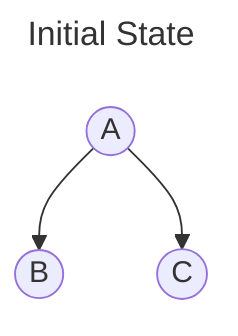
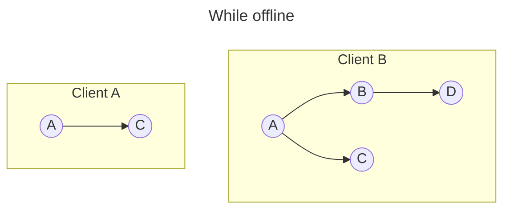
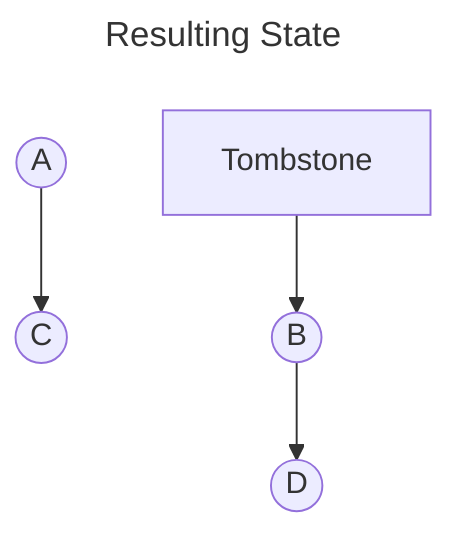
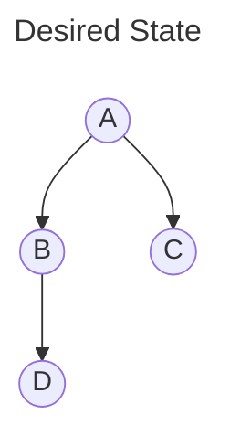

# Local-first Sync Engine

- [Goals](#goals)
- [Assumptions](#assumptions)
- [Approach: Custom Sync Engine](#approach-custom-sync-engine)
  - [An argument for SQLite](#an-argument-for-sqlite)
  - [CRDTs](#crdts)
    - [Thought Index](#thought-index)
      - [Implementation considerations](#implementation-considerations)
      - [Maintaining history](#maintaining-history)
    - [Tree CRDT](#tree-crdt)
      - [Reference Implementations](#reference-implementations)
      - [Pure SQLite implementation](#pure-sqlite-implementation)
        - [Step 1: Table Creation](#step-1-table-creation)
        - [Step 2: View the current tree structure](#step-2-view-the-current-tree-structure)
        - [Step 3: Out-of-order move insertion](#step-3-out-of-order-move-insertion)
          - [Preventing Cycles](#preventing-cycles)
        - [Step 4: View final state](#step-4-view-final-state)
        - [BONUS: Subtree resolution](#bonus-subtree-resolution)
      - [Custom Deletion/Restore Strategy](#custom-deletionrestore-strategy)
    - [Timestamps](#timestamps)
    - [Consistency](#consistency)
      - [Relying on centralized server](#relying-on-centralized-server)
      - [Merkle trees](#merkle-trees)
  - [Architecture](#architecture)
    - [Cloud](#cloud)
    - [Clients](#clients)
  - [Authentication](#authentication)
    - [Centralized user-management service](#centralized-user-management-service)
    - [Anonymous authentication](#anonymous-authentication)
  - [Replication](#replication)
    - [Full replication](#full-replication)
    - [Subtree replication](#subtree-replication)
    - [Duplication](#duplication)
  - [Performance](#performance)
    - [Multiplexing during replication](#multiplexing-during-replication)
    - [Snapshots](#snapshots)
    - [Epochs](#epochs)
    - [Splitting tables for smaller memory footprint](#splitting-tables-for-smaller-memory-footprint)
  - [Additional References](#additional-references)

## Goals

Sorted by priority. These have been derived from the [requirements](https://github.com/cybersemics/em/wiki/Local%E2%80%90First-Sync-Engine#requirements) and form the basis for the process of elimination of suitable technologies and approaches.

1. **Convergence**:<br>
   All replicas must _eventually_ reflect the same state, independent of the order in which changes are made and distributed across devices. Users **must not** be involved in this process, conflict resolution must be deterministic and commutative.

2. **Tree Consistency**:<br>
   The tree must at all times remain a DAG.

3. **(Subtree) Replication**:<br>
   The system must be able to replicate data, and especially a slice of the tree, to other clients.

## Assumptions

- Operational transformation (OT) algorithms [don't achieve convergence](https://www.youtube.com/watch?v=B5NULPSiOGw&t=643s) or require an online central server for coordination and complex conflict resolution.

- To achieve the mentioned goals, only CRDTs are fully suited. OT brings too much complexity and maintenance overhead.

- If conflict resolution is required, its surface area and complexity must be minimal in order to be feasible.

- CRDTs over a tree are hard, especially `move` operations, making this an uncommon problem to solve for prebuilt solutions.

- Off-the-shelf solutions are not suited for the unique tree shape of our data or don't provide hands-off conflict resolution (sources linked).<br>
  Many existing solutions offer JSON or List CRDTs, which are inadequate for our problem:

  1. Tree Structure Integrity: JSON and List CRDTs lack inherent mechanisms to enforce parent-child relationships and prevent cycles or orphans in a tree structure. This is crucial for maintaining a valid thought hierarchy.

  2. Inconsistent States: Using a List CRDT could lead to inconsistent states across replicas. For example, if Client A adds "B" as a child of "A", and Client B (unaware of this change) adds "A" as a child of "B", a List CRDT would accept both operations, potentially creating an invalid cycle.

  3. Memory Constraints: These approaches often assume the entire data structure is in memory, which is unfeasible for a system with 1M+ thoughts. Our solution needs to efficiently handle large-scale data without loading the full structure into memory.

  4. Context-Aware Operations: Efficient tree operations and conflict resolution require context about node relationships, which is challenging to maintain with JSON or List CRDTs without compromising performance or scalability.

  5. Custom Conflict Resolution: Our system requires deterministic, hands-off conflict resolution that preserves the tree's integrity. Generic CRDTs may not provide the level of customization needed for our specific use case.

  Representing the tree as anything but a tree is not a real option, validity cannot be enforced otherwise.
  This renders the following solutions unsuitable:

  - [CozoDB](https://github.com/cozodb/cozo-docs): No information on sync and merge strategy.
  - [Ditto](https://docs.ditto.live/sync/consistency-models): Provides LWW-Map, JSON CRDT support only
  - [DXOS](https://docs.dxos.org/guide/echo/): Provides JSON CRDT only
  - [electric-next](https://github.com/electric-sql/electric/blob/main/packages/sync-service/lib/electric/replication/changes.ex): Only simple PG row-replication.
  - [Fireproof](https://fireproof.storage/posts/remote-access-crdt-wrapped-multi-writer-enabled-immutable-file-format/): Sounds most promising, but probably not a real CRDT that is used as basis and sounds like more fluff than substance.
  - [Jazz](https://jazz.tools/): Provides JSON and List CRDTs only.
  - [Liveblocks](https://liveblocks.io/): Real-time layer, no local-first primitives.
  - [Partykit](https://www.partykit.io/): Real-time layer, no local-first primitives.
  - [PowerSync](https://www.powersync.com/): SQL row replication is insuffienct.
  - [SyncProxy](https://www.syncproxy.com/): Not CRDT based.
  - [TinyBase](https://tinybase.org/#synchronize-between-devices): JSON CRDT only.
  - [Tripilt](https://www.triplit.dev/docs/offline-mode): Partial replication only, no CRDT.
  - [WatermelonDB](https://watermelondb.dev/docs/Sync/Backend#tips-on-implementing-server-side-changes-tracking): Offloads merging to the application's backend.
  - [cr-sqlite](https://github.com/vlcn-io/cr-sqlite#how-does-it-work): Interesting CRDT extension for SQLite replication, yet unsuitable for tree structure.

  However, [Loro](https://loro.dev/docs/tutorial/tree) implements a Tree CRDT based on the recommended [move operation](https://martin.kleppmann.com/papers/move-op.pdf). Loro is a CRDT library that implements common CRDTs in WASM and exposes them to JS. They export a binary representation of updates and leaves any further transport/syncing/persistence to the application. There does not seem to be any good reference point for building a sync server for this. Additionally, the entire data set is loaded into memory or generated from updates, which is not ideal for our use case.

- We need to model our state and operations in a way that they align with CRDTs, not try to make them fit as an afterthought.

- (Local) full-text search is either a direct result of the chosen local DB or needs to be treated as a separate problem. Possible (naive) solutions might include calculating and storing a separate map of `trigram/n-gram -> thought`.

# Approach: Custom Sync Engine

## An argument for SQLite

Given the fact that any solution must incorporate local persistence and with the added limitations a browser runtime poses, SQLite is a great candidate to build upon:

- **Portability:**<br>
  SQLite is highly portable and can run in various environments, including browsers through WebAssembly. This aligns well with our need for a local-first solution that can work across different platforms and devices. Additionally, running the same SQLite database in the cloud allows for a cloud replica based on the same codebase.

  - [Turso](https://turso.tech/)
  - [Cloudflare D1](https://developers.cloudflare.com/d1/)

- **Overcoming limitations of IndexedDB:**<br>
  While IndexedDB is a native browser storage solution, it has limitations in terms of query capabilities, document size and performance for complex data structures like our thought tree. SQLite offers a more robust and flexible querying system.

- **WASM:**<br>
  SQLite can be compiled to WebAssembly, enabling near-native performance in browser environments. This is particularly important for our use case, where we need to handle large datasets and perform frequent operations on the thought tree.

  - [sql.js](https://github.com/sql-js/sql.js)
  - [wa-sqlite w/ OPFS](https://github.com/rhashimoto/wa-sqlite)

- **Transactions:**<br>
  SQLite's transactional nature can help ensure data integrity during sync operations, and its well-established ecosystem provides tools and extensions that could be valuable for implementing features like full-text search.

- **Exports:**<br>
  SQLite databases can be exported to a single file, which can be easily transported and stored.

## CRDTs

In order to greatly reduce the complexity of the problem, we will separate the shape of the tree from individual node contents.

### Thought Index

We can treat our collection of nodes as a G-Set of LWW-Registers, practically speaking a map of unique IDs to node data that always favors the most recent update. This approach allows for:

1. Concurrent additions: New nodes can be added independently by different replicas.
2. Last-write-wins updates: When conflicting updates occur, the most recent update (based on timestamps) is applied.
3. Efficient merging: Merging node collections from different replicas is straightforward.

#### Implementation considerations

- Each node must have a unique identifier with practical collision resistancy (e.g., UUID or nanoid).
- Node data should include a totally ordered timestamp for last modification, see [timestamps](#timestamps).
- The merge operation should compare timestamps and keep the most recent version of each node.
- In order to support the order of childrens within the tree (which is not supported by the recommended tree algorithm), we store the rank of each node. Although this is not a fully consistent solution in a distributed system, it might be a good enough approximation within our use case to maintain the order of childrens.
- Could translate to a simple SQLite table with a primary key and a timestamp column, no need to maintain or sync an operations log.
- Server-sync can be implemented by requesting the nodes with a timestamp greater than the last synced timestamp, partially applying the changes and sending all nodes with a timestamp greater than the last synced timestamp.
- This approach does not intend for deletion of node contents, which is not a problem for our use case. However, in order to save space, we could discard the contents of deleted nodes from the local device while the local tree does not have a reference to them. In case of a conflict resolution that results in the node being added back to the tree, the contents could be dynamically loaded from the server.

#### Maintaining history

Although not necessary for the core functionality, it might be useful to maintain a history of operations to support features like undo/redo or to be able to see the history of a node.

In order to support this, we could introduce a new table that stores the history of `set(node, content)` operations for each node. This should be maintained separately from other tables, as it might grow very large.

### Tree CRDT

There have been multiple approaches to tree CRDTs, but there is a common trend towards using [a highly-available move operation for replicated
trees](https://martin.kleppmann.com/papers/move-op.pdf). [Loro](https://www.loro.dev/blog/movable-tree#movable-tree-crdts-implementation-in-loro) implements this. As of today, this represents the most promising solution to the problem and is suggested as basis for the implementation.

Alternative approaches, applied by Figma:

- [CRDT: Mutable Tree Hierarchy](https://madebyevan.com/algos/crdt-mutable-tree-hierarchy/)
- [CRDT: Fractional Indexing](https://madebyevan.com/algos/crdt-fractional-indexing/)

#### Reference Implementations

- [TypeScript](https://github.com/codesandbox/crdt-tree)
- [Rust](https://github.com/maidsafe/crdt_tree)
- [PHP](https://github.com/dan-da/crdt-php)

#### Pure SQLite implementation

The following approach is a pure SQLite implementation of the suggested tree CRDT algorithm that allows offloading the compute logic to the DB (or more performant WASM runtime). This removes the heavy memory and compute burden on a server and clients, as opposed to CRDT solutions that rely on having the entire state in memory, e.g. Yjs and Automerge.

The proposed Tree CRDT algorithm is particularly well-suited for this scenario.

As a simple demo, the following SQLite statements can be executed in the [`wa-sqlite browser demo`](https://rhashimoto.github.io/wa-sqlite/demo/?build=asyncify&config=IDBBatchAtomicVFS&reset).

##### Step 1: Table Creation

First, we create a `nodes` and `op_log` table and seed some dummy data. Note that the following tables include additional `content` and `is_tombstone` fields that would be removed in a production implementation and only exist for the sake of this demo.

```sql
CREATE TABLE IF NOT EXISTS nodes (
    id TEXT PRIMARY KEY,
    parent_id TEXT,
    content TEXT,
    is_tombstone INTEGER DEFAULT 0,
    FOREIGN KEY (parent_id) REFERENCES nodes(id)
);

CREATE TABLE IF NOT EXISTS op_log (
    seq INTEGER PRIMARY KEY AUTOINCREMENT,
    timestamp INTEGER NOT NULL,
    node_id TEXT NOT NULL,
    old_parent_id TEXT,
    new_parent_id TEXT,
    FOREIGN KEY (node_id) REFERENCES nodes(id),
    FOREIGN KEY (old_parent_id) REFERENCES nodes(id),
    FOREIGN KEY (new_parent_id) REFERENCES nodes(id)
);

CREATE INDEX IF NOT EXISTS idx_nodes_parent_id ON nodes(parent_id);
CREATE INDEX IF NOT EXISTS idx_op_log_timestamp ON op_log(timestamp);

-- Insert dummy data
INSERT INTO nodes (id, parent_id, content) VALUES
('ROOT', NULL, 'Root node'),
('A', 'ROOT', 'Node A'),
('B', 'ROOT', 'Node B'),
('C', 'A', 'Node C'),
('D', 'B', 'Node D'),
('E', 'B', 'Node E');

-- Insert some operations into op_log
INSERT INTO op_log (timestamp, node_id, old_parent_id, new_parent_id) VALUES
(1623456780, 'A', NULL, 'ROOT'),
(1623456781, 'B', NULL, 'ROOT'),
(1623456782, 'C', NULL, 'A'),
(1623456783, 'D', NULL, 'B'),
(1623456784, 'E', NULL, 'B');
```

##### Step 2: View the current tree structure

```sql
-- View nodes
SELECT * FROM nodes;

-- View the operation log
SELECT * FROM op_log ORDER BY timestamp, seq;
```

Output:

| id   | parent_id | content   | is_tombstone |
| ---- | --------- | --------- | ------------ |
| ROOT | null      | Root node | 0            |
| A    | ROOT      | Node A    | 0            |
| B    | ROOT      | Node B    | 0            |
| C    | A         | Node C    | 0            |
| D    | B         | Node D    | 0            |
| E    | B         | Node E    | 0            |

| seq | timestamp  | node_id | old_parent_id | new_parent_id |
| --- | ---------- | ------- | ------------- | ------------- |
| 1   | 1623456780 | A       | null          | ROOT          |
| 2   | 1623456781 | B       | null          | ROOT          |
| 3   | 1623456782 | C       | null          | A             |
| 4   | 1623456783 | D       | null          | B             |
| 5   | 1623456784 | E       | null          | B             |

##### Step 3: Out-of-order move insertion

Now, we insert an out-of-order move operation before the last operation. Within a transaction, we rollback all operations that have been applied after the out-of-order operation and reapply them to the new state.

```sql
BEGIN TRANSACTION;

-- Step 1: Create temp_undone_state
CREATE TEMPORARY TABLE temp_undone_state AS
WITH RECURSIVE ops_to_undo AS (
    SELECT seq, node_id, old_parent_id, new_parent_id
    FROM op_log
    WHERE timestamp >= 1623456783
    ORDER BY timestamp DESC, seq DESC
)
SELECT id,
       COALESCE(
           (SELECT old_parent_id
            FROM ops_to_undo
            WHERE node_id = nodes.id
            ORDER BY seq ASC
            LIMIT 1),
           parent_id
       ) AS parent_id
FROM nodes;

-- Step 2: Insert the out-of-order operation
INSERT INTO op_log (timestamp, node_id, old_parent_id, new_parent_id)
VALUES (1623456783, 'C', 'A', 'B');

-- Step 3: Create temp_final_state
CREATE TEMPORARY TABLE temp_final_state AS
WITH ops_to_redo AS (
    SELECT seq, node_id, old_parent_id, new_parent_id
    FROM op_log
    WHERE timestamp >= 1623456783 AND seq > (SELECT MAX(seq) FROM op_log WHERE timestamp = 1623456783)
    ORDER BY timestamp ASC, seq ASC
)
SELECT id,
       COALESCE(
           (SELECT new_parent_id
            FROM ops_to_redo
            WHERE node_id = temp_undone_state.id
            ORDER BY seq DESC
            LIMIT 1),
           CASE
               WHEN id = 'C' THEN 'B'  -- Apply the out-of-order operation
               ELSE parent_id
           END
       ) AS new_parent_id
FROM temp_undone_state;

-- Step 4: Update the nodes table
UPDATE nodes
SET parent_id = (
    SELECT new_parent_id
    FROM temp_final_state
    WHERE temp_final_state.id = nodes.id
)
WHERE id IN (SELECT id FROM temp_final_state WHERE id != new_parent_id);

-- Step 5: Clean up
DROP TABLE temp_undone_state;
DROP TABLE temp_final_state;

COMMIT;
```

###### Preventing Cycles

As outlined in [the paper](https://martin.kleppmann.com/papers/move-op.pdf), a move operation creating a cycle can be identified by checking for whether the node being moved to is an ancestor of the destination node. If such a cycle is detected, the operation is simply ignored.

Due to the fact that we're applying operations in the outlined undo/redo fashion, this cycle resolution is convergent across all clients.

The above implementation does not include cycle detection for brevity.

##### Step 4: View final state

```sql
-- View the updated tree structure
SELECT * FROM nodes;

-- View the updated operation log
SELECT * FROM op_log ORDER BY timestamp, seq;
```

Output:

| id   | parent_id | content   | is_tombstone |
| ---- | --------- | --------- | ------------ |
| ROOT | null      | Root node | 0            |
| A    | ROOT      | Node A    | 0            |
| B    | ROOT      | Node B    | 0            |
| C    | B         | Node C    | 0            |
| D    | B         | Node D    | 0            |
| E    | B         | Node E    | 0            |

| seq     | timestamp        | node_id | old_parent_id | new_parent_id |
| ------- | ---------------- | ------- | ------------- | ------------- |
| 1       | 1623456780       | A       | null          | ROOT          |
| 2       | 1623456781       | B       | null          | ROOT          |
| 3       | 1623456782       | C       | null          | A             |
| 4       | 1623456783       | D       | null          | B             |
| **_6_** | **_1623456783_** | **_C_** | **_A_**       | **_B_**       |
| 5       | 1623456784       | E       | null          | B             |

##### BONUS: Subtree resolution

The proposed table structure allows for resolution of an entire subtree. This is particularly useful for subtree replication or export. Here, we access the entire subtree of Node B.

```sql
WITH RECURSIVE subtree AS (
    -- Base case: the node we start from
    SELECT id, parent_id, content, 0 AS level
    FROM nodes
    WHERE id = 'B'

    UNION ALL

    -- Recursive case: children of nodes already in the subtree
    SELECT nodes.id, nodes.parent_id, nodes.content, subtree.level + 1
    FROM nodes
    JOIN subtree ON nodes.parent_id = subtree.id
    WHERE nodes.is_tombstone = 0  -- Exclude tombstone nodes
)
SELECT
    id,
    parent_id,
    content,
    level,
    CAST(SUBSTR('--------------------------------', 1, level) || id AS TEXT) AS tree_view
FROM subtree
ORDER BY level, id;
```

Output:

| id  | parent_id | content | level | tree_view |
| --- | --------- | ------- | ----- | --------- |
| B   | ROOT      | Node B  | 0     | B         |
| C   | B         | Node C  | 1     | -C        |
| D   | B         | Node D  | 1     | -D        |
| E   | B         | Node E  | 1     | -E        |

#### Custom Deletion/Restore Strategy

During conflict resolution of the suggested algorithm, move operations are inserted at the correct time according to the totally ordered timestamp and all afterwards operations are reapplied to the new state. This may result in a node (and their children) being deleted from the tree:



Client A deletes Node B, while Client B adds Node D as a child of Node B.



We'll denote the two operations as follow, roughly following the shape of the paper `move(node, newParent)`:

| Client | Operation            |
| ------ | -------------------- |
| A      | `move(B, Tombstone)` |
| B      | `move(D, B)`         |

Following the algorithm presented by the paper, no matter in which order either of these operations are applied, the resulting tree will look as follows:



In our case, this is an unwanted outcome. Instead, whenever new nodes are added to the tree while any of its ancestors is concurrently deleted, we want to restore the ancestor node. In this example, the desired outcome would be:



Achieving this outcome in a distributed system in a convergent way without additional information is not possible, as we cannot determine whether the deletion of Node B happened intentionally, i.e. with knowledge of the existence of its child D. In order to achieve this, we need to introduce a new parameter that records the time of the last synchronization of operations that this client has applied. Note that this cannot be compared to the totally ordered timestamp at which the operation has been executed by the client, as this might not have propagated in time. A server must preserve operations in the following format:

| Client | Operation          | Execution Time [the time it was executed by the (offline) client] | Last Client Sync Time [the last time the client has synchronized with the server] | Server Sync Time [the time at which the operation was distributed to the server] |
| ------ | ------------------ | ----------------------------------------------------------------- | --------------------------------------------------------------------------------- | -------------------------------------------------------------------------------- |
| A      | move(B, Tombstone) | 2024-08-08T10:00:00Z-000A                                         | 2024-08-08T09:00:01Z                                                              | 2024-08-08T12:00:01Z                                                             |
| B      | move(D, B)         | 2024-08-08T11:00:01Z-000B                                         | 2024-08-08T09:00:01Z                                                              | 2024-08-08T12:00:01Z                                                             |

Given this additional metadata on operations, a (server) participant can reason about whether `move(B, Tombstone)` had previous knowledge of added children. If this is not the case, a `move(B, PrevParent)` operation can be appended to the list of operations, effectively restoring Node B. If any other ancestor of B was deleted, the same logic should be applied recursively.

This extension is not part of the original paper, but is necessary to achieve the desired outcome. The above SQLite can be adjusted to cover this within the out-of-order move insertion.

### Timestamps

In order to create a total order of timestamps, we cannot rely on simple wall-clock times, as these are not guaranteed to be strongly monotonic. Instead, we can use [Lamport timestamps](https://en.wikipedia.org/wiki/Lamport_timestamp) or [Hybrid Logical Clocks](https://jaredforsyth.com/posts/hybrid-logical-clocks/).

In our system, we can base our implementation on this [JavaScript implementation of a hybrid logical clock](https://github.com/jlongster/crdt-example-app/blob/master/shared/timestamp.js).

### Consistency

Since this approach relies on operations to calculate the final state, in order to achieve full consistency across clients, a client must be able to make an argument on whether they have seen all operations distributed across the network.

#### Relying on centralized server

The simplest and most pragmatic way of arguing about the correctness of a client's state is to rely on a centralized server that serves as main node and is in charge of both distributing and persisting operations. Since our applications intends for cloud storage of a Thoughtspace, this is a natural fit.

In order to further simplify the implementation, we assume the following:

1. Operations are immutable. An operation, once stored, may not be updated in the future.
2. The network is "safe". We assume that an operation received by a client is correct and untampered with. No operations are lost.
3. All operations are persisted and distributed by the main node, acting as a relay.

With these assumptions, we can make an argument about the correctness of a client's state by comparing an additional timestamp indicating _when the main node has seen this operation_. This timestamp must be distributed to clients with the operation. If the timestamp on the last seen operation on both clients is the same, we can assume that the client has seen all operations distributed across the network.

If necessary, this approach can be made robust by comparing both timestamp and count of all persisted operations or using a form of hash, e.g. a [Merkle tree](#merkle-trees).

#### Merkle trees

A [Merkle tree](https://en.wikipedia.org/wiki/Merkle_tree) calculated over all operations, deterministically and recursively grouped e.g. by timestamp, can be used to identify whether two clients have seen the same set of operations. Using a main (server) node, allows to quickly compare the root node of the tree to identify whether a client has seen all operations.

If this is not the case, the client can recursively compare tree nodes to identify the exact timeframe in which operations are missing. This allows to efficiently identify the set of operations that the client has not seen yet, even if they have been inserted out-of-order in the far past.

This approach does not rely on a centralized server or additional information, but can be implemented in a decentralized way by using a gossip protocol. Compared to the [recommended approach](#relying-on-centralized-server), this adds computational overhead and added complexity.

A sample implementation can be found in [James Longster's crdt-example-app](https://github.com/jlongster/crdt-example-app).

## Architecture

The suggested architecture for this use case is a centralized one, relying on a main node to act as a relay for operations. This allows to simplify the implementation and focus on the core problem of conflict resolution.

### Cloud

- **Per-thoughtspace ephemeral compute instances powered by [Partykit](https://partykit.dev/)**:<br>
  Partykit is built on top of Cloudflare Workers, allowing to run a per-thoughtspace compute instance. Their main selling point is collaboration, bringing a robust layer of abstraction on top of (large amounts of) Websockets. Dealing with per-thoughtspace compute instances significantly simplifies the implementation, as the main node does not need to deal with the complexities of a multi-tenant system.

  Additionally, due to the fact that Cloudflare Workers run on their global edge platform, the spawned worker would be located closest to the first opened connection.

  Partykit has recently been acquired by Cloudflare.

  Note: Elixir/Erlang's model would allow for similar functionality, but would come at the cost of using another programming language and having to host and maintain servers. Edge functionality would be infeasible to implement on top of this.

- **Per-thoughtspace SQLite database, hosted via [Turso](https://turso.tech/)**:<br>
  Turso is a hosted SQLite database service, allowing to easily create a database per thoughtspace. The benefit of using Turso as DB-layer for this system is that it allows to write fully platform-independent SQL code. Cloud and local nodes behave exactly the same.

- **Optional: Persistent blob storage**:<br>
  If necessary, a blob storage service can be used to persist snapshots or entire databases for either faster full replication, as means of backup or for other purposes. For this use case, [AWS S3](https://aws.amazon.com/s3/) and [Cloudflare R2](https://www.cloudflare.com/products/r2/) are both good candidates.

### Clients

- **Local SQLite database via [`wa-sqlite`](https://github.com/rhashimoto/wa-sqlite)**:<br>
  On the clients, `wa-sqlite` is used to provide a performant local SQLite database. In the capacitor app, we want to fall back to the native implementation for performance gains.

  `wa-sqlite` allows multiple different VFS providers including IndexedDB and OPFS. Here, we need to make a decision on which provides the most robust, performant and supported backend.

## Authentication

In a Partykit room (the preferred terminology), authentication can be implemented using an `onBeforeConnect` hook that has access to the `request` object.

In our case, we can either authenticate users using a central user-management service or

### Centralized user-management service

One approach to manage authorization would be to use a centralized service combined with JWTs, e.g. [Auth0](https://auth0.com/).

### Anonymous authentication

Alternatively (and if we don't want to store user data), we can anonymously issue JWTs signed by a private key accessible to the room. These can be issued via an API endpoint (on the partykit room) and distributed via email, link or some other way of communication. The JWT should in this case be scoped to the thoughtspace and valid permanently to allow for full local-first functionality.

Issued JWTs can additionally be tracked by an ID in the database, allowing to invalidate them if necessary.

## Replication

### Full replication

Full replication can be achieved by either loading all operations and thought content from the main node or by directly downloading the entire SQLite database.

Distributing all operations should be sent in batches via WebSockets, only loading chunks into partykit room memory as needed.

### Subtree replication

A specific subtree can be replicated and distributed as result of a [subtree query](#bonus-subtree-resolution). Spawning a separate thoughtspace from this subtree is also possible by allowing the new partykit room to request data from the main node. Operations on either the main node or the replicated subtree node must be relayed other partykit rooms operating on (parts) of the same thoughtspace. Partykit allows this inter-room communication easily.

### Duplication

Additionally to replication, we can support full duplication of a thoughtspace by duplicating the SQLite database within Turso.

## Performance

The performance of this implementation relies heavily on the SQLite instance locally. From limited testing with synthetic large-scale datasets (1M+ thoughts), the achieved performance is more than sufficient.

### Multiplexing during replication

Since replication of operations and thoughts is done via WebSockets, we can multiplex the connection to allow for concurrent replication of multiple chunks within a thoughtspace, potentially via different partykit rooms. If necessary and DB-reads to a single thoughtspace become a bottleneck, we can think about read-replicas or maintaining multiple open connections to the DB provider.

### Snapshots

The list of operations is consistently growing and can become quite large to sync fully. A potential shortcut is to sync the current state of the nodes and a truncated list of operations. This poses a problem should very old out-of-order moves occur, in this case the client would have to sync the before truncated list of operations.

### Epochs

A way of achieving the same performance boost as with snapshots is to use epochs. As with [snapshots](#snapshots), the state of the thoughtspace is persisted as a snapshot at regular intervals. However, this interval defines an epoch which marks the snapshot as immutable. Out-of-order operations that would need to be applied before this epoch are discarded.

This eliminates the forced sync with snapshots, but comes at the trade-off that a client's changes that occurred before the epoch are discarded and their work is lost. It may also result in an inconsistent state if a client is offline for a long time.

If we would want to implement this, we would need to think about ways to handle this conflict properly, e.g. with a hard fork for the client that is trying to apply the out-of-order operation.

### Splitting tables for smaller memory footprint

When relying on IndexedDB as VFS, there have been reports of degrading performance when objects grow too large. A common way to work around this is to split the table into smaller tables and selectively pick the table to read from.
(I'm afraid I lost the reference to where this was mentioned, but decided to include it for completeness... 😅)

---

## Additional References

https://www.loro.dev/docs/tutorial/encoding#best-practices-for-persisting-loro-documents

https://vlcn.io/docs/cr-sqlite/crdts/sequence-crdts

https://github.com/vlcn-io/cr-sqlite/issues/65

https://www.sqlite.org/loadext.html

https://github.com/rhashimoto/wa-sqlite?tab=readme-ov-file

https://github.com/vlcn-io/cr-sqlite?tab=readme-ov-file

https://github.com/jlongster/crdt-example-app

https://github.com/jamsocket/fractional_index

https://archive.jlongster.com/using-crdts-in-the-wild

https://electric-sql.com/docs/integrations/drivers/server/better-sqlite3

https://github.com/jlongster/absurd-sql